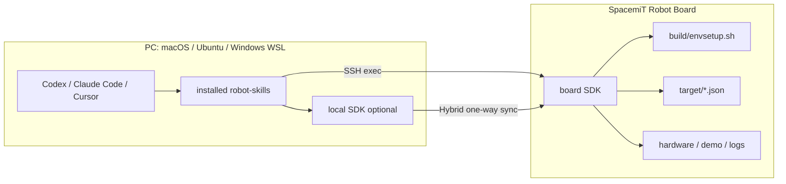
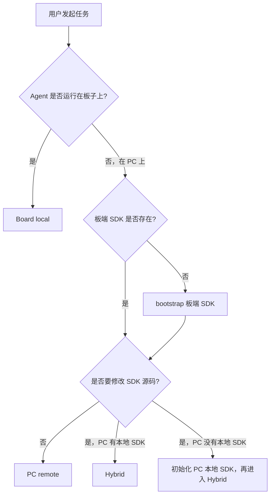

# robot-skills 三模式安装与开发方案

## 1 目标与结论

`robot-skills` 要做成可安装、可被 Codex、Claude Code、Cursor 等 coding agent 使用的 SpacemiT Robot SDK skills 包。用户安装后，可以在 PC 或板子上让 Agent 完成 SDK 环境检查、代码开发、构建、运行和验证。

核心结论：

- 支持三种模式：Board local、PC remote、Hybrid。
- 用户不需要手动理解和选择所有模式，Agent 应根据运行位置、SDK 是否存在、是否要改源码自动选择。
- Hybrid 不使用交叉编译，也不在 PC 构建目标产物；PC 只负责读代码、改代码、生成 patch 和静态分析，板子负责真实构建、运行、测试和硬件验证。
- 日常开发验证不默认调用 `scripts/test/robot-test`；它只用于 CI、回归验证或用户明确要求。

| 模式 | Agent 运行位置 | 源码主工作区 | 构建/运行/测试位置 | 适用场景 |
| --- | --- | --- | --- | --- |
| Board local | 板子 | 板子 SDK | 板子 | 板端直接开发、硬件联调、离线开发 |
| PC remote | PC | 板子 SDK | 板子 | 从 PC 远程检查、构建、运行板端现有代码 |
| Hybrid | PC | PC 本地 SDK | 板子 | PC 本地改代码，单向同步到板子验证 |

## 2 设计依据

当前 SDK 和仓库形态决定了 skills 的边界：

| 事实 | 对设计的影响 |
| --- | --- |
| SDK 是 `repo` 多项目工作区 | Hybrid 同步必须按 project 做 preflight，不能把它当单一 Git 仓库 |
| 构建入口是 `build/envsetup.sh` | 所有构建、运行、测试前都要按 SDK 规则加载环境 |
| 正式 SDK 根变量是 `SROBOTIS_ROOT` | 文档和 skill 主路径变量统一使用 `SROBOTIS_ROOT` |
| `target/*.json` 下同一 board 可能有多个 product | target 不唯一时必须询问用户，不能按文件名前缀猜 |
| `scripts/test/robot-test` 偏 CI/回归 | 日常开发默认参考组件 README、demo 或 `mm` 验证 |
| PC 和板端首次都可能没有 SDK | 需要 bootstrap 流程先初始化 SDK，再进入开发模式 |

已知示例路径：

- PC 本地 SDK：`/Users/laumy/workspace/spacemit_robot`。
- 板端 SDK：`bianbu@10.0.90.29:/home/bianbu/spacemit_robot`。

## 3 总体架构



三种模式共用同一套 skills，只是运行配置和源码主工作区不同。

## 4 安装与配置

正式安装路径只保留两类。

命令行安装：

```bash
npx skills add spacemit-robotics/robot-skills --agent codex
npx skills add spacemit-robotics/robot-skills --agent claude-code
npx skills add spacemit-robotics/robot-skills --agent cursor
```

Agent 链接安装：

```text
请安装这个 SpacemiT Robot skills:
https://github.com/spacemit-robotics/robot-skills
```

仓库需要补齐的安装元数据：

| 类型 | 文件 |
| --- | --- |
| skills catalog | `skills.sh.json` |
| Codex 插件元数据 | `plugins/spacemit-robot-skills/.codex-plugin/plugin.json` |
| Claude Code 插件元数据 | `plugins/spacemit-robot-skills/.claude-plugin/plugin.json` |
| Cursor 插件元数据 | `plugins/spacemit-robot-skills/.cursor-plugin/plugin.json` |

运行配置不要写死在 skill 中，统一从用户请求、命令行参数、环境变量或 profile 读取。

| 变量 | 用途 |
| --- | --- |
| `SROBOTIS_MODE=local|remote|hybrid` | 当前模式 |
| `SROBOTIS_ROOT` | Board local 的 SDK 根目录 |
| `SROBOTIS_REMOTE` | 远端登录地址，例如 `bianbu@10.0.90.29` |
| `SROBOTIS_REMOTE_ROOT` | 板端 SDK 根目录 |
| `SROBOTIS_LOCAL_ROOT` | Hybrid 的 PC 本地 SDK 根目录 |
| `SROBOTIS_TARGET` | 可选 target；不唯一时必须询问用户 |

配置文件支持两类：

| 配置位置 | 适用场景 |
| --- | --- |
| `~/.config/spacemit-robot/targets.yaml` | 首次接触、PC 本地还没有 SDK、跨项目复用同一块板子 |
| `.spacemit-robot/targets.yaml` | PC 本地 SDK 已存在后的项目级配置 |

配置优先级：用户本次请求 > 命令行参数 > 环境变量 > 项目配置 > 全局配置 > 自动发现 > 询问用户。

## 5 用户流程与模式选择

用户首次接触时，PC 和板子上都可能没有 SDK。Agent 应先完成安装、连接板子和 SDK bootstrap，再根据任务意图进入 PC remote 或 Hybrid。



首次接触推荐话术：

```text
请安装 https://github.com/spacemit-robotics/robot-skills ，然后连接板子 bianbu@10.0.90.29。
如果板子上还没有 SDK，请先把 SDK 初始化到 /home/bianbu/spacemit_robot，然后帮我检查环境。
```

模式选择表：

| 用户意图 | 推荐模式 |
| --- | --- |
| 板端还没有 SDK | 先 bootstrap 板端 SDK |
| Agent 已经运行在板子上 | Board local |
| PC 上只想检查板子、构建现有代码、跑 demo | PC remote |
| PC 上要读代码、改代码、生成 patch | Hybrid |
| PC 没有本地 SDK，但只是临时远程执行命令 | PC remote |
| PC 没有本地 SDK，但要正式开发 | 先拉 PC 本地 SDK，再用 Hybrid |

典型场景可以收敛成三条规则：

| 场景 | 处理方式 |
| --- | --- |
| 只看环境、构建现有代码、运行 demo | PC remote，不需要 PC 本地 SDK |
| 修改 SDK 源码并验证 | Hybrid，本地改代码，单向同步到板端构建运行 |
| Agent 直接在板子上运行 | Board local，不需要 SSH 和同步 |

## 6 三种模式边界

### 6.1 Board local

Board local 是板端直接开发模式。

| 项目 | 规则 |
| --- | --- |
| SDK 根目录 | `SROBOTIS_ROOT=/home/bianbu/spacemit_robot` |
| 执行位置 | 板子本机 |
| 是否 SSH | 不需要 |
| 是否同步 | 不需要 |
| 验证方式 | `source build/envsetup.sh` 后按组件 README、demo 或 `mm` 验证 |

### 6.2 PC remote

PC remote 是 PC 远程控制板端 SDK 的模式，板子上的 SDK 是唯一工作区。

| 项目 | 规则 |
| --- | --- |
| 源码主工作区 | 板端 SDK |
| PC 是否需要 SDK | 不需要 |
| 执行方式 | SSH 到板子，在板端 SDK 中执行命令 |
| 适合任务 | 环境检查、target 识别、构建现有代码、运行 demo、查看日志 |
| 不适合任务 | 长期代码编辑和反复 patch |

如果用户从“构建失败帮我看”变成“帮我修代码”，Agent 应提示切换到 Hybrid。

### 6.3 Hybrid

Hybrid 是 PC 本地 SDK 做源码主工作区、板子做真实执行环境的模式。

```text
PC local SDK: read / edit / patch
        |
        | one-way sync
        v
Board SDK: source envsetup / build / run / test
```

Hybrid 明确不做：

- 不使用交叉编译。
- 不使用 PC Docker 构建目标产物。
- 不做远端到本地的自动反向同步。
- 不做双向合并。
- 不自动同步 `.repo/`、`.git` 和构建产物。

## 7 核心实现

第一版只保留少量基础 skills，先把安装、SDK 初始化、远程执行、构建和 Hybrid 同步闭环做稳。

| Skill | 作用 | 优先级 |
| --- | --- | --- |
| `spacemit-robot-shared` | SDK root、mode、target、通用安全规则 | P0 |
| `spacemit-robot-sdk-bootstrap` | 首次在板端或 PC 初始化 SDK 工作区 | P0 |
| `spacemit-robot-remote` | SSH、远程检测、远程执行 | P0 |
| `spacemit-robot-build` | `lunch`、`m`、`mm` 构建决策 | P0 |
| `spacemit-robot-sync` | Hybrid 单向同步和 repo preflight | P0 |

关键实现规则：

| 能力 | 规则 |
| --- | --- |
| 统一执行器 | local 模式本地执行；remote/hybrid 模式通过 SSH 在板端执行；保留退出码和关键日志 |
| SDK root 检查 | 至少检查 `build/`、`components/`、`application/`、`target/` |
| target 选择 | 先确定 board，再读 `target/*.json`；同一 board 多 product 时询问用户 |
| Hybrid 同步 | 默认 dry-run；只允许 PC 到板子单向同步；同步后在板端构建运行 |
| repo preflight | `--path` 映射到 repo project，比较本地/远端 revision，远端 dirty 时默认停止 |
| 排除规则 | 不同步 `.repo/`、`.git`、`output/`、缓存、日志、临时文件和构建产物 |
| `robot-test` | 不作为日常默认验证；只在 CI、回归或用户明确要求时使用 |

## 8 约束与安全

| 类型 | 规则 |
| --- | --- |
| 凭据 | 不保存明文密码，优先使用 SSH key |
| 高风险命令 | 不自动执行 `sudo`、`reboot`、`poweroff`、系统升级、批量删除 |
| bootstrap | `sudo apt`、创建 SDK 目录、`repo init`、`repo sync` 前必须让用户确认 |
| 同步 | 默认不删除远端文件，不覆盖远端 dirty project |
| target | 不唯一时停止并询问，不猜测 |
| 硬件动作 | 电机、机械臂、抓取、底盘、语音播放、摄像头采集等动作需要确认设备状态和安全条件 |
| Windows | P0 推荐 WSL + OpenSSH；原生 PowerShell 支持后续增强 |

## 9 落地计划与验收

当前仓库优先修正：

| 事项 | 说明 |
| --- | --- |
| README | 更新为完整安装和三模式入口 |
| 环境变量 | 主变量迁移到 `SROBOTIS_ROOT`，`SPACEMIT_SDK_ROOT` 仅作历史兼容 |
| 安装元数据 | 增加 `skills.sh.json` 和 Codex / Claude Code / Cursor plugin manifest |
| 基础 skills | 补齐 remote、build、sync，并修正 shared 和 sdk-bootstrap |
| contract test | 覆盖安装布局、SDK root 检查、禁止硬编码路径和 target |

分阶段落地：

| 阶段 | 目标 | 交付物 |
| --- | --- | --- |
| P0 | 安装可用，SDK 可初始化，PC remote 与 Hybrid 最小闭环可跑 | README、plugin metadata、shared/bootstrap、remote、build、sync、repo preflight |
| P1 | 开发体验增强 | profile 管理、日志摘要、冲突提示、常用 demo/runbook |
| P2 | 组件覆盖扩展 | omni-agent、reachy-mini、vision、vlm、peripherals、mcp 等高频 skill |
| P3 | CI/回归增强 | 按需整理 `robot-test` 用法、结果摘要、CI contract |
| P4 | 多团队维护 | `components.d/`、同步工作流、内容完整性校验或签名 |

P0 验收标准：

| 方向 | 验收点 |
| --- | --- |
| 安装 | Codex、Claude Code、Cursor 至少能通过标准入口安装 |
| 首次接触 | 板端无 SDK 时能识别未初始化，并按 bootstrap 流程初始化 |
| PC remote | 能 SSH 到板子，检查 SDK root，读取 board/target，执行只读诊断和轻量构建 |
| Hybrid | 能 dry-run 同步计划，识别 repo project，发现 revision 不一致或远端 dirty，apply 后在板端构建验证 |
| 安全 | target 不唯一时询问；同步默认不删除；危险硬件动作必须显式确认 |

最终目标不是复制 NVIDIA skills 的规模，而是学习它的安装和治理方式。`robot-skills` 第一阶段最重要的是把三种模式的执行闭环做稳：能安装、能识别 SDK、能选择 target、能构建、能验证、能安全地把 PC 本地改动同步到板子。
